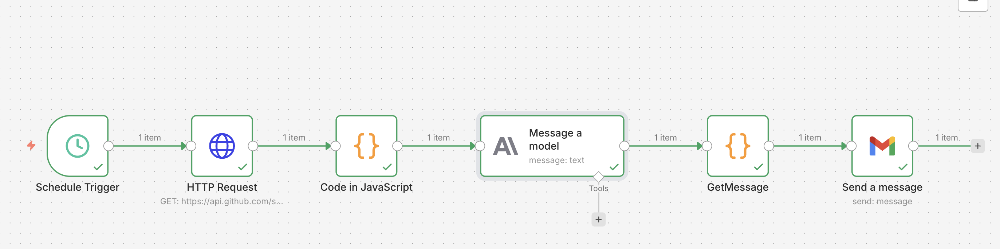
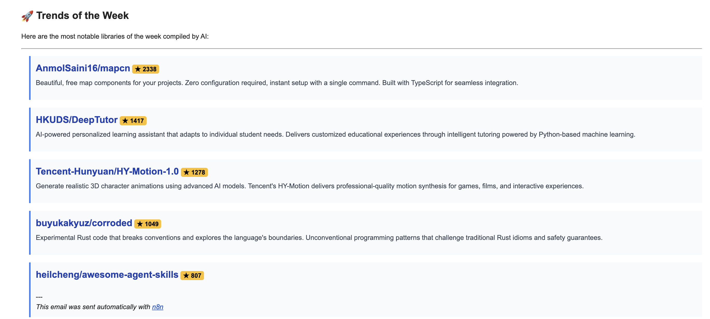

# Github Trend Hunter 🏹

This n8n workflow discovers the hottest GitHub repositories of the week, summarizes them using AI, and delivers a curated trend report to your inbox.

## 🚀 Features

*   **Weekly Trends**: Automatically fetches repositories created in the last 7 days with the highest star counts.
*   **AI Curation**: Uses Anthropic's Claude to generate punchy, tech-focused summaries for each repo.
*   **HTML Formatting**: The AI formats the list into a clean, modern HTML design suitable for email apps.
*   **Email Delivery**: Sends a weekly digest every Monday at 09:00 AM.

## 🛠️ Prerequisites

1.  **Anthropic API Key**: Required for the AI model to generate summaries.
2.  **Gmail OAuth2**: To send the weekly newsletter.
3.  **No GitHub Token Needed**: Uses the public GitHub search API (rate limits apply, but sufficient for weekly runs).

## 🔄 Workflow Logic

1.  **Schedule Trigger**: Runs every Monday at 09:00.
2.  **HTTP Request**: Queries GitHub API for `sort:stars` and `created:>7days`.
3.  **Code (JS)**: Prepares a text prompt containing repo details (Name, Link, Stars, Description).
4.  **Message a model**: Claude processes the list and returns an HTML-formatted summary.
5.  **GetMessage (JS)**: clean the AI response.
6.  **Send a message**: Delivers the final HTML report via Gmail.

## 📝 Example Output

The email you receive will look something like this:

