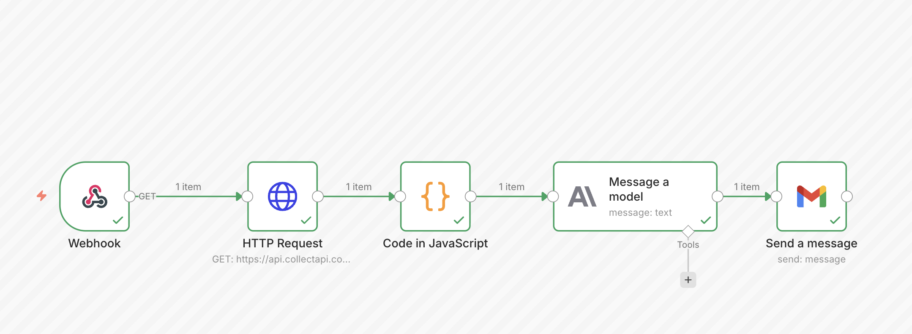

# Automated Gold Financial Analyst 📉

This n8n workflow automates the process of tracking gold prices, analyzing market trends using AI, and sending daily reports via email.

## 🚀 Features

*   **Real-time Data Fetching**: Retrieves current gold prices (Gram, ONS) and daily rates using the CollectAPI.
*   **Data Processing**: Filters and formats the raw data using JavaScript.
*   **AI Analysis**: Uses Anthropic's Claude to generate a specialized financial commentary and trend analysis in Turkish.
*   **Email Reporting**: Sends a beautifully formatted HTML email daily with price summaries, AI insights, and trend indicators.

## 🛠️ Prerequisites

To run this workflow, you need the following credentials set up in n8n:

1.  **CollectAPI Key**: Sign up at [CollectAPI](https://collectapi.com/) and subscribe to the "Gold Price" API.
2.  **Anthropic API Key**: An account with Anthropic to use the Claude model.
3.  **Gmail OAuth2**: Authenticated Gmail account to send the reports.

## 📦 Installation

1.  **Import**: Import the `Automated Gold Financial Analyst.json` file into your n8n instance.
2.  **Credentials**: 
    *   Open the **HTTP Request** node and enter your CollectAPI `authorization` header value (apikey).
    *   Setup the **Anthropic** and **Gmail** credentials if they are not already configured.
3.  **Config**: Update the recipient email address in the **Send a message** node.

## 🔄 Workflow Logic

1.  **Webhook / Trigger**: Starts the flow (currently set to manual or webhook trigger).
2.  **HTTP Request**: GET request to `https://api.collectapi.com/economy/goldPrice`.
3.  **GetGoldPrice (JS)**: Extracts `Gram Altın` and `ONS Altın` data from the API response.
4.  **Message a model**: Claude analyzes the `rate` and `price` to determine if the trend is "Upward", "Downward", or "Stable" and writes a 1-sentence comment.
5.  **GetMessage (JS)**: Parses the AI's response to ensure it uses the correct JSON format.
6.  **Send a message (Gmail)**: HTML template is populated with the data and sent to the subscriber.

## 📝 Example Output

> **Günlük Altın Analizi**
>
> *   **Gram Altın:** 2500 TL (%1.2)
> *   **ONS Altın:** 2300 USD
>
> *🤖 Yapay Zeka Yorumu: "Gram altın fiyatlarında küresel belirsizlikler nedeniyle yukarı yönlü bir hareket gözlemleniyor."*
