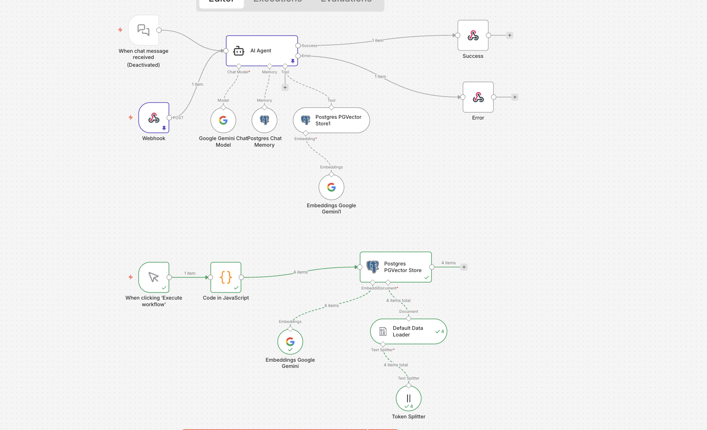

# 🤖 AI Knowledge Base Agent (RAG with n8n & PostgreSQL)


A production-ready **Retrieval-Augmented Generation (RAG)** agent built with **n8n**, **PostgreSQL (pgvector)**, and **Google Gemini**.

This project demonstrates how to build a semantic search engine that can answer user queries based on a private knowledge base, featuring **cross-lingual support** and **graceful error handling**.

---

## 🚀 Key Features

*   **🧠 Semantic Search:** Uses Vector Embeddings (Google Gecko) to understand the *meaning* behind queries, not just keyword matching.
*   **🌍 Multi-Language Support:** The agent can understand and answer queries in multiple languages, even if the knowledge base is in English.
*   **🛡️ Robust Error Handling:** Implements a "Try-Catch" pattern within n8n. If the database is offline, it returns a structured 500 JSON error instead of crashing or timing out.
*   **⚡ Real-time Vectorization:** Embeddings are generated on-the-fly using Google's generative AI models.
*   **💾 Structured Metadata:** PostgreSQL schema utilizes `JSONB` for flexible metadata filtering (`category`, `price_range`, etc.).

---

## 🏗️ Architecture

The system follows a modern RAG pipeline:

1.  **Ingestion:** Raw text/JSON is processed, chunked, and embedded into vectors.
2.  **Storage:** Vectors and metadata are stored in **PostgreSQL** using the `pgvector` extension.
3.  **Retrieval:** User query is converted to a vector -> System searches for the nearest neighbors (Cosine Similarity).
4.  **Generation:** The retrieved context + user query are sent to **Gemini Pro**, which generates the final natural language response.



---

## 🛠️ Tech Stack

*   **Orchestrator:** [n8n](https://n8n.io/) (Self-hosted)
*   **Database:** PostgreSQL 16 + `pgvector`
*   **LLM & Embeddings:** Google Gemini Pro & text-embedding-004
*   **Containerization:** Docker & Docker Compose

---

## 📋 Prerequisites

Before running this workflow, ensure you have the following:

1.  **n8n instance** (Self-hosted or Cloud).
2.  **PostgreSQL Database** with `pgvector` extension installed.
3.  **Google Cloud Platform Account** with Vertex AI / Gemini API enabled.

---

## ⚙️ Setup Guide

### 1. Database Setup
Connect to your PostgreSQL database and enable the vector extension. This is critical for storing embeddings.

```sql
CREATE EXTENSION IF NOT EXISTS vector;
```

*Note: The n8n workflow will automatically create the `documents` table if it doesn't exist, but the extension must be enabled first.*

### 2. n8n Credentials
You need to set up the following credentials in your n8n instance:

*   **Postgres account**:
    *   **Host**: Your DB host (e.g., `postgres` if using Docker network, or `localhost`).
    *   **Database**: Your database name.
    *   **User/Password**: Your DB credentials.
*   **Google Gemini(PaLM) Api account**:
    *   **API Key**: Your Google AI Studio or Vertex AI API key.

### 3. Import Workflow
1.  Open n8n.
2.  Create a new workflow.
3.  Click the three dots `...` in the top right -> **Import from File**.
4.  Select `Pgvector Rag Agent.json`.

---

## 🏃 Usage

This workflow has two main modes of operation:

### Mode 1: Ingestion (Seeding the Knowledge Base)
First, you need to populate your vector database with data.

1.  Open the workflow canvas.
2.  Locate the **"When clicking ‘Execute workflow’"** trigger node.
3.  Click **Execute Workflow** at the bottom of the screen.
4.  The workflow will:
    *   Take sample JSON data (Laptops, HR Policies, etc.).
    *   Generate embeddings using Google Gemini.
    *   Insert them into your PostgreSQL `documents` table.

### Mode 2: Chat (RAG Agent)
Once the data is ingested, you can chat with the agent.

1.  Ensure the workflow is **Active**.
2.  Send a POST request to the Webhook URL.

#### Sample Request
```bash
curl -X POST [YOUR_WEBHOOK_URL] \
-H "Content-Type: application/json" \
-d '{
  "sessionId": "test-session-1",
  "chatInput": "Can you recommend a powerful laptop?"
}'
```

---

## 🔌 API Reference

### Chat Request (POST)

**Endpoint:** `[YOUR_N8N_WEBHOOK_URL]`

**Body:**
```json
{
  "sessionId": "user-session-123",
  "chatInput": "I need a powerful laptop for Docker and compilation tasks."
}
```

**Success Response (200):**
```json
{
  "status": "success",
  "data": {
    "answer": "I recommend the DevBook Pro X1...",
    "sessionId": "user-session-123",
    "timestamp": "2024-01-01T12:00:00.000Z"
  }
}
```

**Error Response (500):**
```json
{
  "status": "error",
  "error": {
    "message": "The service refused the connection - perhaps it is offline",
    "timestamp": "2024-01-01T12:00:00.000Z"
  }
}
```