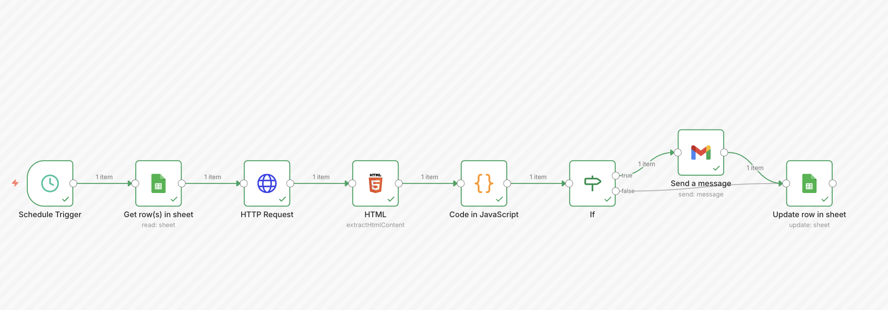

# Automated Price Tracker 🏷️

This n8n workflow automates product price tracking by scraping e-commerce websites and syncing data with Google Sheets. It sends email alerts when a target price is hit or a discount is detected.

## 🚀 Features

*   **HTML Extraction**: Scrapes product prices using CSS selectors (`.a-price`, etc.).
*   **Google Sheets Sync**: Reads product links and target prices from a sheet, and updates the "Last Price".
*   **Smart Alerts**: Logic to detect price drops, increases, or if a target price is reached.
*   **Email Notifications**: Sends an alert with the old vs. new price and the product link.

## 🛠️ Prerequisites

1.  **Google Sheets**: A sheet named `ProductList` with the following headers:
    *   `Product`: Name of the item.
    *   `URL`: Link to the product page.
    *   `TargerPrice`: (Note: Logic currently looks for 'TargerPrice', check your column header) The price you want to be alerted at.
    *   `LastPrice`: The last recorded price.
2.  **Google Cloud Service Account**: Credentials for n8n to access the sheet.
3.  **Gmail OAuth2**: To send the alert emails.

## 🔄 Workflow Logic

1.  **Schedule Trigger**: Runs periodically (e.g., every hour).
2.  **Google Sheets (Get)**: Fetches the list of products to check.
3.  **HTTP Request**: Visits each product URL.
4.  **HTML Extract**: Grabs the price text using CSS selectors.
5.  **Code (JS)**: Cleans the price string (currency symbols, decimals), compares it with `LastPrice` and `TargetPrice`, and determines if an alert is needed.
6.  **If**: Checks if `isAlert` is true.
7.  **Send Message**: Sends an email if a condition is met.
8.  **Google Sheets (Update)**: Updates the `LastPrice` in the sheet for the next run.

## ⚠️ Important Notes

*   **Selectors**: The HTML extract node uses Amazon-style selectors (`.a-price`). You may need to adjust these for other websites.
*   **Typos**: Please inspect the JavaScript node; it currently references `TargerPrice` (instead of TargetPrice). Ensure your Sheet column matches this name or update the code.
